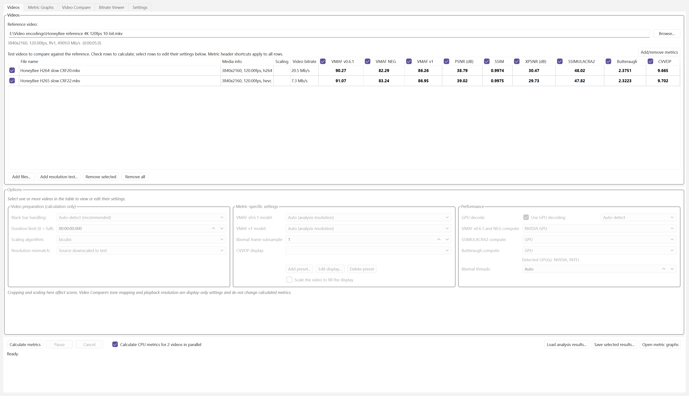
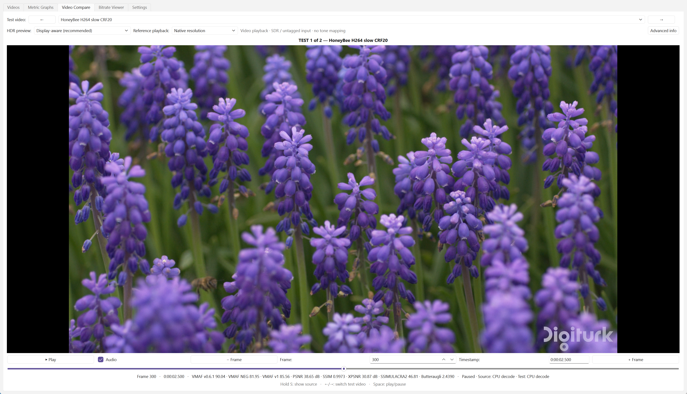
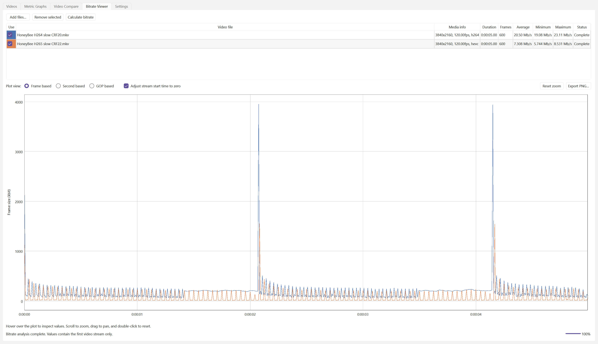

# VideoQual

[](LICENSE)
[](docs/USER_GUIDE.md)
[](requirements.txt)
[](docs/USER_GUIDE.md)

**VideoQual** is a desktop lab for measuring video quality. Point it at a
reference video and one or more test encodes, and it calculates industry-standard
quality metrics — VMAF, PSNR, SSIM, XPSNR, SSIMULACRA2, Butteraugli, and
ColorVideo VDP — with GPU acceleration, per-frame graphs, frame-exact A/B
comparison playback, and an independent bitrate viewer.

Built for codec engineers, streaming teams, and anyone who needs to *prove*
that an encode looks better — not just guess.

---

## At a glance

| Videos | Metric graphs |
|:------:|:-------------:|
|  |  |
| Configure each test independently, inspect codec and bitrate, and calculate multiple metrics in one run. | Compare real per-frame curves and distribution statistics, with signed deltas at the same moment. |

| Video Compare | Bitrate Viewer |
|:-------------:|:--------------:|
|  |  |
| Switch instantly between reference and test encodes during playback, or seek to an exact frame. | Analyze video-only bitrate independently by frame, second, or GOP — no metrics run needed. |

## Why VideoQual

- **Nine metrics, one run.** VMAF, VMAF NEG, VMAF v1, PSNR, SSIM, XPSNR,
  SSIMULACRA2, Butteraugli, and ColorVideo VDP across multiple test videos,
  each configured independently.
- **GPU-accelerated where it matters.** NVIDIA CUDA VMAF via a bundled libvmaf
  build, Vship CUDA/HIP/Vulkan backends for perceptual metrics, and GPU video
  decoding (NVDEC, QSV/VPL, AMF) with per-input software fallback.
- **Frame-exact A/B comparison.** GStreamer D3D11 playback with FFmpeg fallback
  switches between source and encodes instantly — hold **S** to flash the
  source, or step to an exact frame.
- **Evidence, not vibes.** Per-frame metric curves, distribution statistics,
  signed test-vs-test deltas, auto-saved results, and automatic reload when
  matching videos return.
- **Robust by default.** Black-bar detection, automatic resolution-mismatch
  handling, parallel calculation on many-core CPUs, and crash isolation so a
  GPU fault never takes down the app.
- **Ready for the world.** Translated UI in 20 languages, HDR display support
  with tone mapping, and a self-test mode (`VideoQual.exe --self-test`) that
  verifies the whole pipeline.

## Quick start

1. Select a **reference video**.
2. Add one or more **test videos**.
3. Choose the **metrics** to calculate.
4. Click **Calculate metrics**.

Results land in the video table and the Metric Graphs tab as each test
finishes. Video Compare and the Bitrate Viewer work even without calculating
anything — see the [User Guide](docs/USER_GUIDE.md) for the full tour.

## Install

### Packaged release (recommended)

Download the Windows zip from the
[latest release](https://github.com/rithwik-01/VideoQual/releases/latest),
extract it, and run `VideoQual.exe`.

> The app requires **FFmpeg 9 or newer with libvmaf**. FFmpeg is not bundled;
> the app prompts for its location if it is not on `PATH`.

### Run from source

Requires Python 3.11 or newer on Windows 10/11:

```powershell
py -3 -m venv .venv
.venv\Scripts\python.exe -m pip install -r requirements.txt
.venv\Scripts\python.exe -m videoqual.main
```

## Requirements

- Windows 10 or 11
- FFmpeg 9+ with `ffmpeg`, `ffprobe`, and `libvmaf`
- Optional NVIDIA, Intel, or AMD GPU for hardware decoding and GPU metrics
- Python 3.11+ when running from source

## Documentation

| Guide | What it covers |
|-------|----------------|
| [User Guide](docs/USER_GUIDE.md) | End-to-end workflows, tabs, and settings |
| [Architecture](docs/ARCHITECTURE.md) | How the app, metrics, and playback fit together |
| [Build](docs/BUILD.md) | Building the distributable from source |
| [Troubleshooting](docs/TROUBLESHOOTING.md) | Common failures and fixes |
| [Known Issues](docs/KNOWN_ISSUES.md) | Currently tracked limitations |
| [GStreamer Bundle](docs/GSTREAMER_BUNDLE.md) | How playback packaging works |
| [Releasing](docs/RELEASING.md) | Publication and release checklist |
| [Changelog](CHANGELOG.md) | What changed in each version |

## Project layout

```text
VideoQual/
├── videoqual/            # Application package (Qt UI + metric engines)
│   ├── core/             # Metrics, runners, playback, caching, GPU layers
│   ├── ui/               # Main window, graph/compare/bitrate views, workers
│   ├── models/           # Bundled VMAF scoring models
│   ├── tools/            # Bundled libvmaf / Vship / libjxl binaries
│   └── translations/     # UI strings in 20 languages
├── native/               # GPU decoder + tone-mapping C++ sources
├── tests/                # pytest suites, factories, and fixtures
├── scripts/              # Build, packaging, and developer utilities
├── docs/                 # Guides and screenshots
└── VideoQual.spec        # PyInstaller release spec
```

## Development

```powershell
.venv\Scripts\python.exe -m pip install -r requirements-dev.txt
.venv\Scripts\python.exe -m pytest
.venv\Scripts\python.exe -m ruff check videoqual tests scripts
```

Build the distributable with `./scripts/build_release.ps1`. Please read the
[build guide](docs/BUILD.md) and the [contributing guide](CONTRIBUTING.md)
before opening a pull request; security reports belong in
[SECURITY.md](SECURITY.md).

## License

Licensed under the [MIT License](LICENSE). Copyright (c) 2026
**Rithwik Reddy Eedula**. Third-party components retain their own licenses —
see [Third-Party Notices](docs/THIRD_PARTY.md).

### Enjoying VideoQual?

If VideoQual has been useful to you, I would love to hear from you:
[leave a comment / say thanks](https://github.com/rithwik-01/VideoQual/discussions).
You can also star the repository — it helps show the project is useful.
